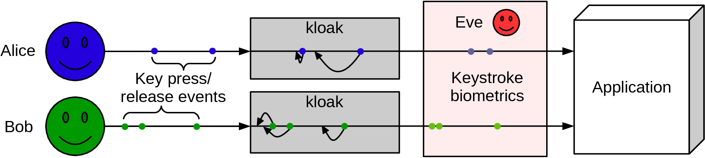

## kloak: *Keystroke-level online anonymization kernel*

    

`kloak` is a privacy tool that makes keystroke biometrics less effective. This is accomplished by obfuscating the time intervals between key press and release events, which are typically used for identification. **This project is still in the prototype stage.**

## Usage

Compile `kloak` and the event capture tool `eventcap`:

    $ make all

Determine which device file corresponds to the physical keyboard. Use `eventcap` (or some other event capture tool) and look for the device that generates events when keys are pressed. This will typically be one of `/dev/input/event[0-9]`. In this example, it's `/dev/input/event4`:

    $ sudo ./eventcap /dev/input/event4
    Reading From : /dev/input/event4 (AT Translated Set 2 keyboard)
    Type:   4    Code:   4    Value:  15
    Type:   1    Code:  15    Value:   0
    Type:   0    Code:   0    Value:   0
    Type:   4    Code:   4    Value:  56
    Type:   1    Code:  56    Value:   0
    Type:   0    Code:   0    Value:   0

Start `kloak` by specifying the input and output device files. The output device will typically be either `/dev/uinput` or `/dev/input/uinput`. Note that since `kloak` and `eventcap` require reading from and writing to device files, they probably won't work without running as root:

    $ sudo ./kloak -r /dev/input/event4 -w /dev/uinput
    
`uinput` is the [kernel module](http://thiemonge.org/getting-started-with-uinput) that allows user-land applications to create input devices. **If you start `kloak` and lose control of your keyboard, the default rescue keys are: Right Shift + Left Shift + Esc. This terminates `kloak`.** You can specify the rescue key combination using the `-k` parameter. 

Verify that it's running successfully by starting in verbose mode and looking for the key received/release events:

    $ sudo ./kloak -r /dev/input/event4 -w /dev/uinput -v
    ...
    +Received event at time: 1482265646198.  Type:   1,  Code:  56,  Value:   1,  Scheduled delay   33 ms 
    -Released event at time: 1482265646198.  Type:   1,  Code:  56,  Value:   1,  Actual delay   33 ms 
    +Received event at time: 1482265646311.  Type:   1,  Code:  15,  Value:   1,  Scheduled delay   77 ms 
    +Received event at time: 1482265646336.  Type:   1,  Code:  56,  Value:   0,  Scheduled delay   33 ms 
    Lower bound raised to:    8 ms
    +Received event at time: 1482265646375.  Type:   1,  Code:  15,  Value:   0,  Scheduled delay   68 ms 
    Lower bound raised to:   29 ms
    -Released event at time: 1482265646311.  Type:   1,  Code:  15,  Value:   1,  Actual delay   77 ms 
    -Released event at time: 1482265646336.  Type:   1,  Code:  56,  Value:   0,  Actual delay   33 ms 
    -Released event at time: 1482265646375.  Type:   1,  Code:  15,  Value:   0,  Actual delay   67 ms

Notice that the lower bound on the random delay has to be raised when keys are pressed in quick succession. This ensures that the key events arrive in the same order as they were generated.

The maximum delay is specified by the `-d` option. This is the maximum delay (in milliseconds) that can occur between the physical key events and the passing of key events to the user-level input device. The default is 100 ms, which was shown to achieve about a 20-30% reduction in identification accuracy and doesn't create too much lag between the user and the application (see the paper below). As the maximum delay increases, the ability to obfuscate typing behavior also increases and the responsive of the application decreases. *This reflects a tradeoff between usability and privacy.*

The full usage and options are:

    Usage: kloak [options]
    Options:
      -r device file: read given input device (multiple allowed)
      -w device file: write to the given uinput device (mandatory option)
      -d delay: maximum delay (in milliseconds) of released events. Default 100.
      -s startup timeout: time to wait (in milliseconds) before startup. Default 100.
      -k rescue keys: csv list of rescue key names to exit kloak in case the
         keyboard becomes unresponsive. Default is 'KEY_LEFTSHIFT,KEY_RIGHTSHIFT,KEY_ESC'.
      -v: verbose mode
      
## Try it out

You can test that `kloak` actually works by trying an [online keystroke biometrics demo](https://www.keytrac.net/en/tryout). For example, try these three different scenarios:
* Train normal, test normal
* Train normal, test kloak
* Train `kloak`, test `kloak`

*Train normal* means to train with normal typing behavior, i.e., without `kloak` running. At the enrollment page on the KeyTrac demo, enter a username and password without `kloak` running, and then on the authenticate page, try authenticating. For example, the train normal/test normal result is:

    

Start `kloak` and then try authenticating again. These results were obtained using a maximum delay of 200 ms (`-d 200`). The train normal/test `kloak` result is:

    

Now go back to the [enrollment page](https://www.keytrac.net/en/tryout). Enroll With `kloak` running and then try authenticating with `kloak` still running. Again, this is with a 200 ms maximum delay. The train `kloak`/test `kloak` result is:

    

Your results may differ, especially in the train `kloak`/test `kloak` scenario. The train `kloak`/test `kloak` scenario is more difficult to anonymize than the train normal/test `kloak` scenario. This is because *kloak obfuscates your typing behavior, but does not make your typing behavior similar to other users*. This dilemma relates to the problem of user cooperation. It's easy to make your typing behavior look like something that it's not, but what should that be? If it's too unique, then the change does more harm then good, allowing you to be easily identified. Without the cooperation of other users, it's difficult to choose a behavior that's hard to distinguish.

## Background

`kloak` has two goals in mind:
* Make it difficult for an adversary to identify a user
* Make it difficult for an adversary to replicate a user's typing behavior

The first goal can theoretically be achieved only if all users cooperate with each other to have the same typing behavior, for example by pressing keys with exactly the same frequency. Since different users type at different speeds, this is not practical. Instead, pseudo-anonymity is achieved by obfuscating a user's typing rhythm, making it difficult for an adversary to re-identify a single user.

The second goal is to make it difficult for an adversary to forge typing behavior and impersonate a user, perhaps bypassing a two-factor authentication that uses keystroke biometrics. This is achieved by making the time between keystrokes unpredictable.

### How it works

The time between key press and release events are typically used to identify users by their typing behavior. `kloak` obfuscates these time intervals by introducing a random delay between the physical key events and the arrival of key events at the application, for example a web browser.

`kloak` grabs the input device and writes delayed key events to the output device. Grabbing the device disables any other application from reading the events. Events are scheduled to be released in a separate thread, where a random delay is introduced before they are written to a user-level input device via `uinput`. This was inspired from [kbd-mangler](https://github.com/bgeradz/Input-Mangler/).

### When does it fail

`kloak` does not protect against all forms of keystroke biometrics that can be used for identification. Specifically,

* If the delay is too small, it is not effective. Adjust the delay to as high a value that's comfortable.
* Repeated key presses are not obfuscated. If your system is set to repeat held-down keys at a unique rate, this could leak your identity.
* Writing style is still apparent, in which [stylometry techniques could be used to determine authorship](http://www.vmonaco.com/publications/An%20investigation%20of%20keystroke%20and%20stylometry%20traits%20for%20authenticating%20online%20test%20takers.pdf).
* Higher level cognitive behavior, such as editing and application usage, are still apparent. These lower-frequency actions are less understood at this point, but could potentially be used to reveal identity.

### More info

See the paper, [Obfuscating Keystroke Time Intervals to Avoid Identification and Impersonation](https://arxiv.org/pdf/1609.07612.pdf)
